## What is a Nanopub?

:::: {.columns}

::: {.column width="30%"}

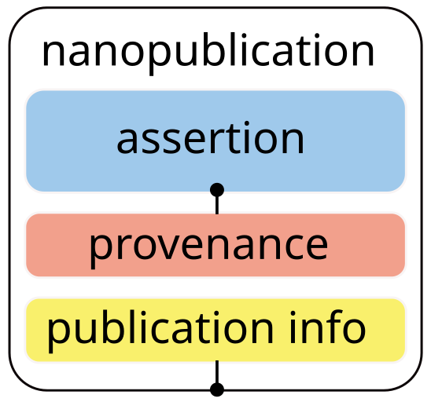

Think of a Nanopub as a little knowledge container

:::

::: {.column width="70%"}

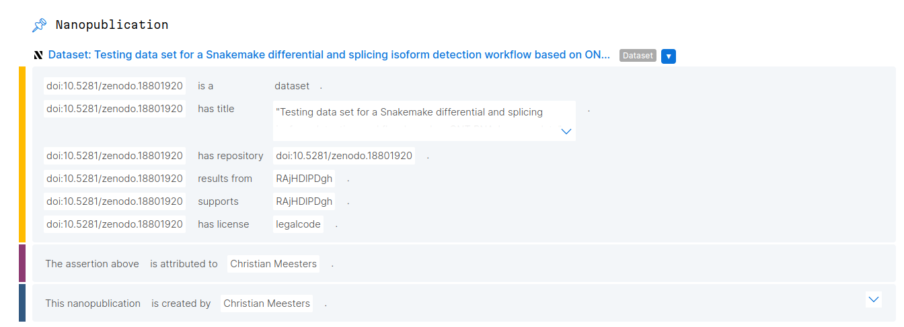
This is an example Nanopub, a dataset description

:::

::::

## Register your account

If you have don't have an account yet, please register at [nanodash](https://nanodash.knowledgepixels.com) using your ORCID iD.

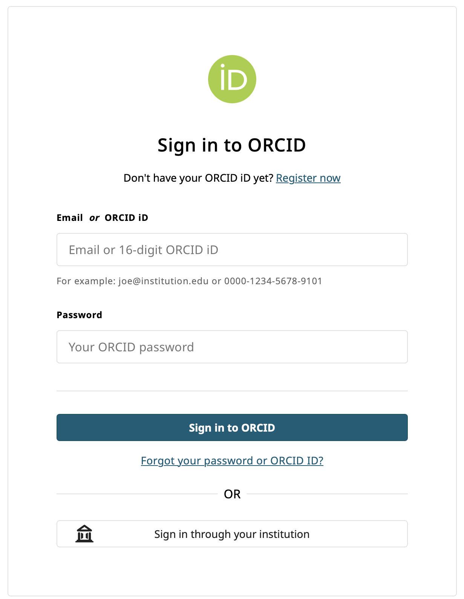

## Interlude: What is an ORCID?

ORCID stands for **O**pen **R**esearcher and **C**ontributor **ID**.

::: {.incremental}

- free, unique & persitent ID
- show your research interest, funding, employment and **publications** (sometimes they add automagically with crossref)
- useful in research to be found:
  - for agencies to look you up during proposal reviews
  - to find colleagues (and see how actively they are engaged and in which topics)

:::

## Interlude: What is an ORCID? II  {.scrollable}

:::: {.columns}

::: {.column width="25%"}

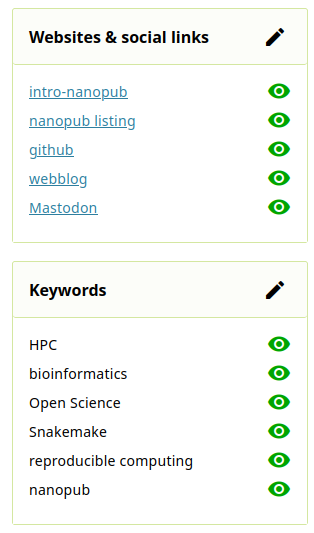

Example screenshot with links and research interests.
:::

::: {.column width="65%"}

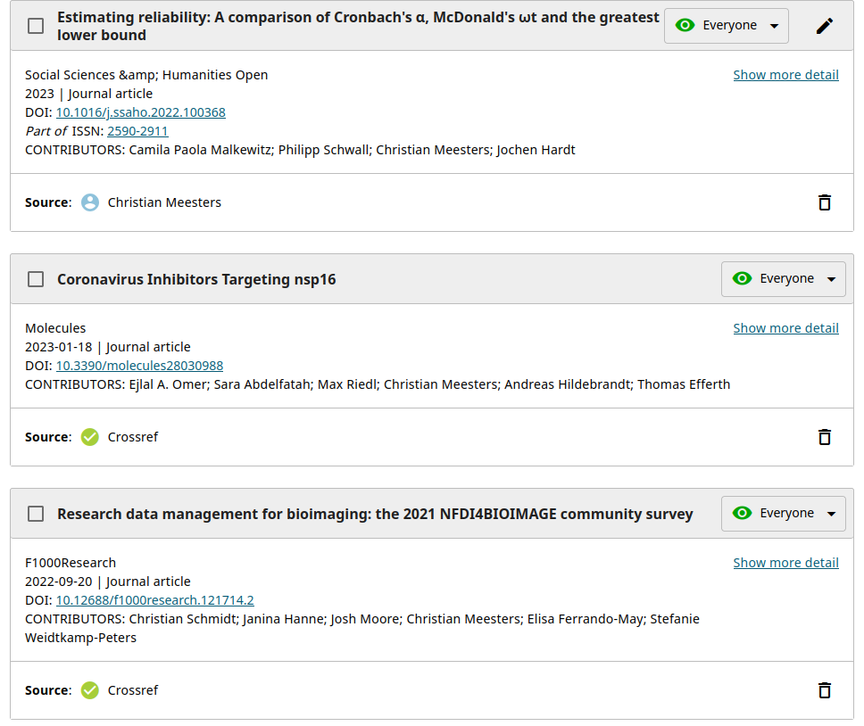

Example screenshot of papers linked in an ORCID profile.

:::
::::

## Authorise ORCID iD and enter your Nanodash account {.scrollable}

::: columns
::: column
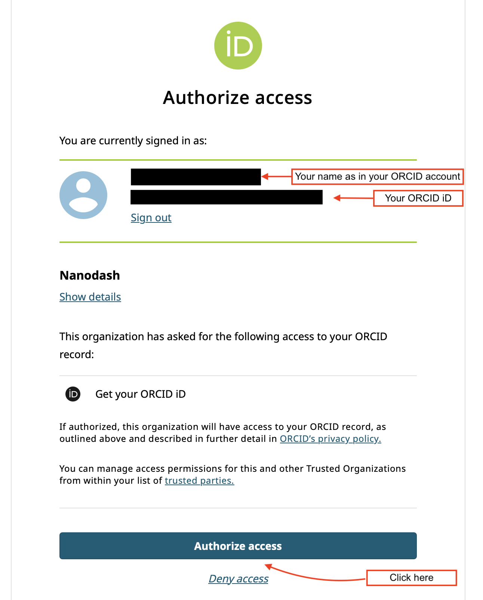
:::

::: column
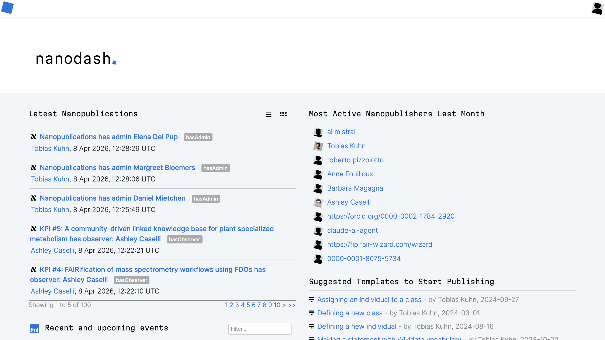
:::
:::

## Introduction of an User

Click on the profile icon in the top right corner to access your profile page.

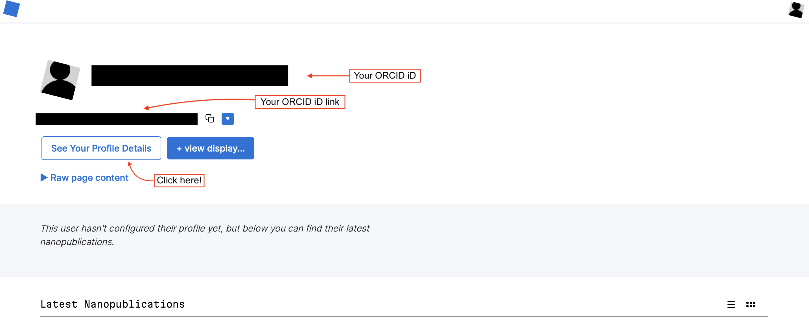

Then click on the "See Your Profile Details" button to access your profile details.

## Create Introduction

Inside the Profile Details page, click on the "Create Introduction" button to create your introduction.

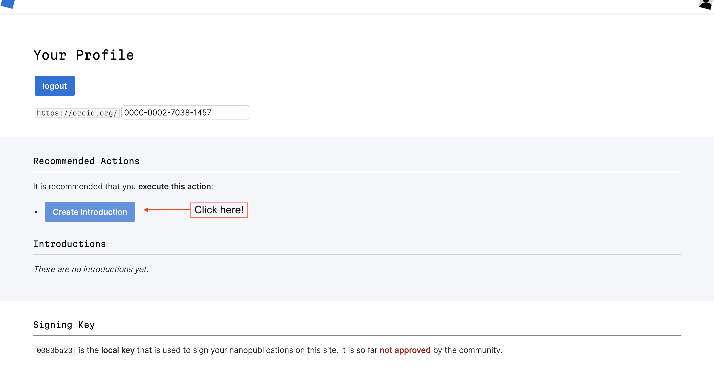

## And then ...

Once inside the introduction page, you will see a "Create Nanopublication" form.

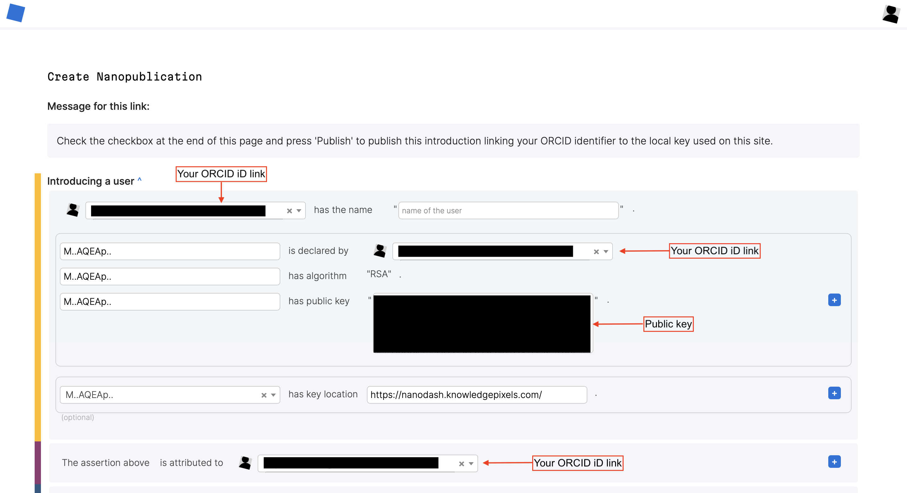

## Complete your introduction

Under the "Introducing a user" section, add your name as you would like it to appear on your profile.

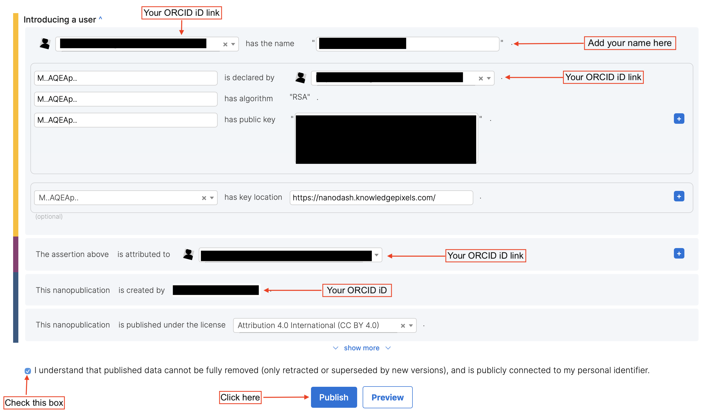

Finally, after you are happy to check the publication button, you should be able to click on the "Publish" button to publish your introduction.

## A published introduction ...

Once the introduction is published, you should now be able to view your name on it.

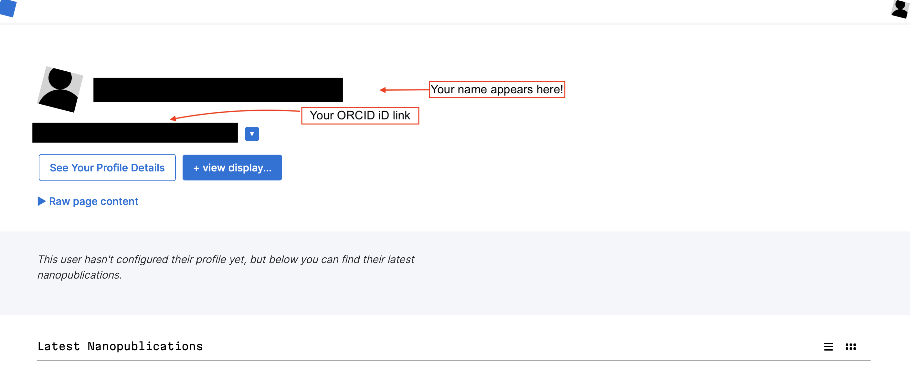

## View latest nanopub

Finally, your name will appear under the latest nanopublications on your profile page.

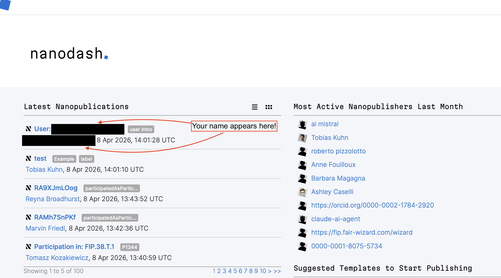

## Add "view display" to your profile

To add display sections to your profile, click on the "+ view display" button and it will open a new page for adding a new display section.

::: columns
::: column
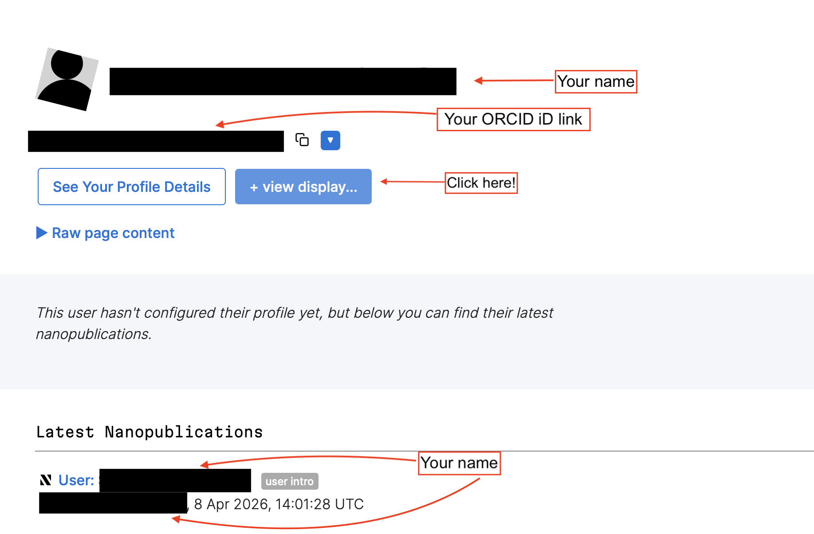
:::

::: column
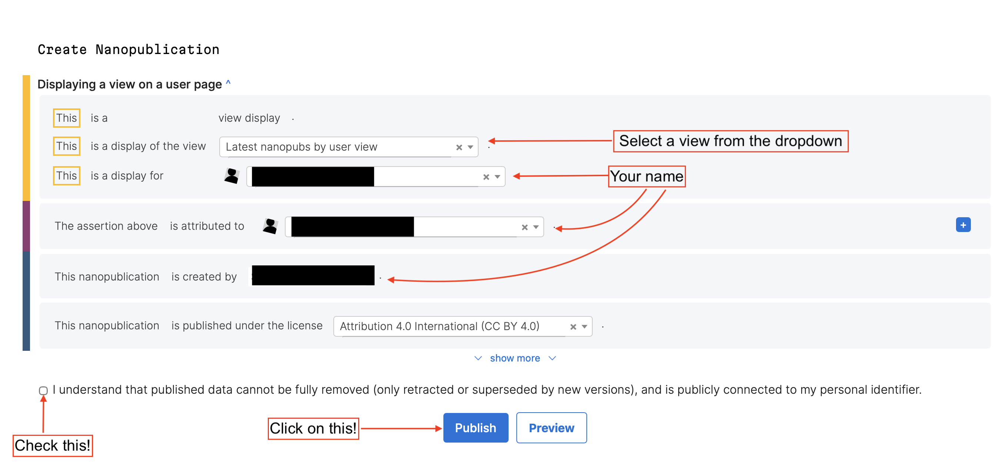
:::
:::

## Approval of an User

Next on our list: approval of a user. Users can be approved by approved users.

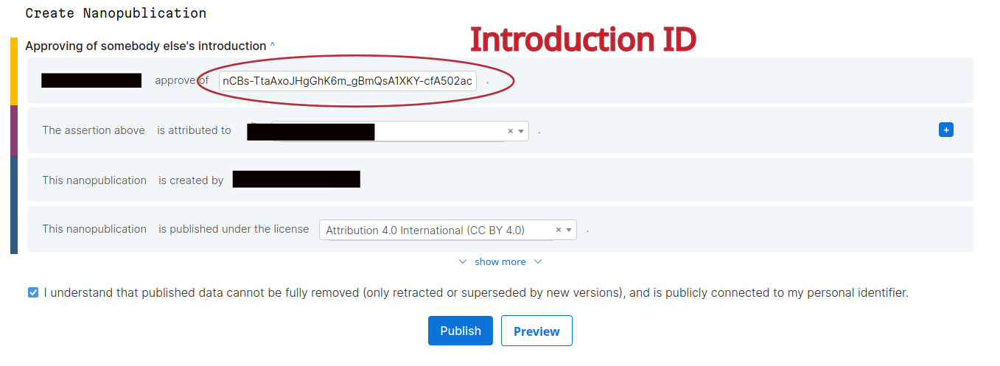

. . .

Task: approve your neighbour(s)!

## Publish using a Template

:::: {.columns}

::: {.column width="30%"}

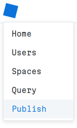

Select "Publish" from the menu.
:::

::: {.column width="70%"}

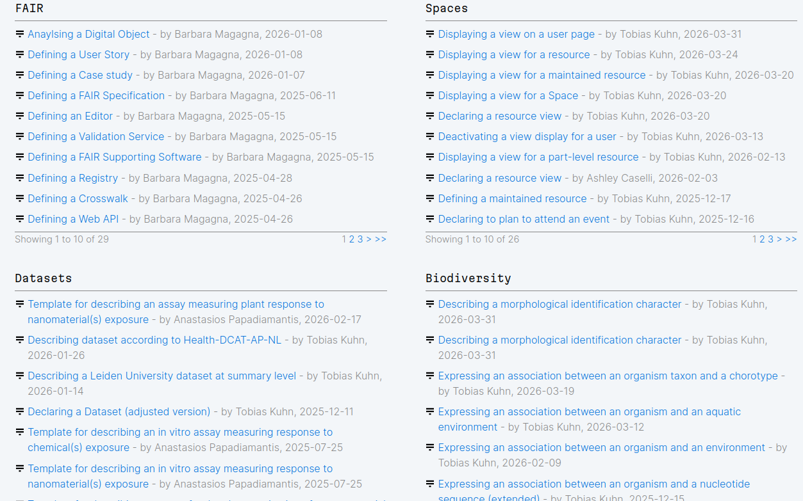

Then you _can_ choose from the list of templates. (We are going to publish together. Please wait.)

:::

::::

## Your first Nanopub! {.scrollable}

Let's select an easy template: Search for "Announcing a paper I have read"

. . .

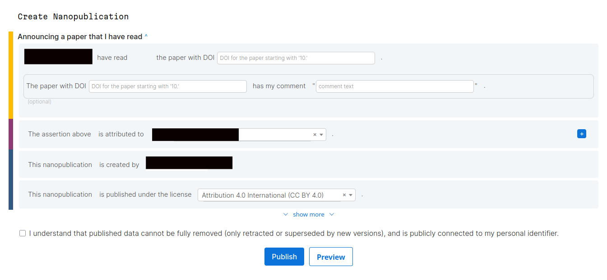

. . .

Select and enter a DOI of a recently read paper.

## Modifying a Template

There are many templates for different purposes and disciplines. _But_, sometimes you need some new template ...

::: {.callout-tip}
# First look, then leap

It is better not to "pollute" the nanopub template space. First look or ask for existing templates.
:::

. . .

::: {.callout-note collapse="true"}

We are **not** going to create a new template in this workshop. But we will briefly show you how its done.
:::

## Modifying a Template II {.smaller}

::: {.incremental}

1. start by selecting a suitable (similar) template and select the little blue caret\
   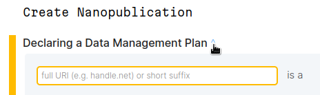
2. then select "edit as derived nanopublication"\
   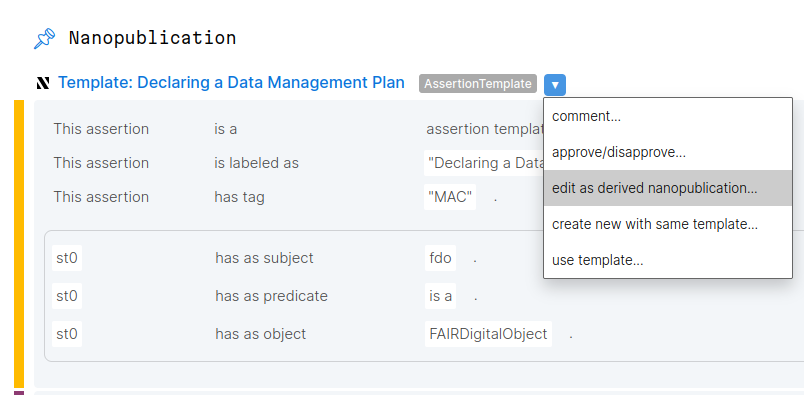{width="15cm"}

:::

## Modifying a Template III

::: {.callout-tip}
# Start small

Creating a new assertion template can be difficult. Start with an easy (or small) one.
:::

. . .

::: {.callout-tip}
# Ask for help!

If you need substantial changes, ask for help. (In the end we show some resources.)
:::

## And now? Where to go from here? {.scrollable}

This workshop _merely_ gave an overview. There is so much more:

::: {.incremental}

- Community:
  - [Nano Sessions](https://nanopub.net/sessions/) - every last Tuesday of a month - reports from practitioners - you may ask questions -  [register here with a nanopub](https://nanodash.knowledgepixels.com/space?id=https://w3id.org/spaces/nanopub/nanosessions)
  - [FENAC](https://nanodash.knowledgepixels.com/space?id=https://w3id.org/spaces/fenac) the "Fearless Early Nanopub Adopters Club" - sign up per nanopub, if you want to know more - members of this club get prioritized feature requests and can claim a free one-on-one call with a core nanopublication/Nanodash developer.
- Resources:
  - [the official tutorial selection](https://nanopub.net/docs/tutorials/)
  - [the documentation](https://nanopub.net/docs/)
- Software which offers an API for automated publication:
  - [the Java library](https://github.com/Nanopublication/nanopub-java)
  - [the Python library](https://github.com/Nanopublication/nanopub-py/)
- Software which uses the API:
  - [the Snakemake reporter plugin for posting workflow metadata](https://github.com/snakemake/snakemake-report-plugin-nanopub/)

:::